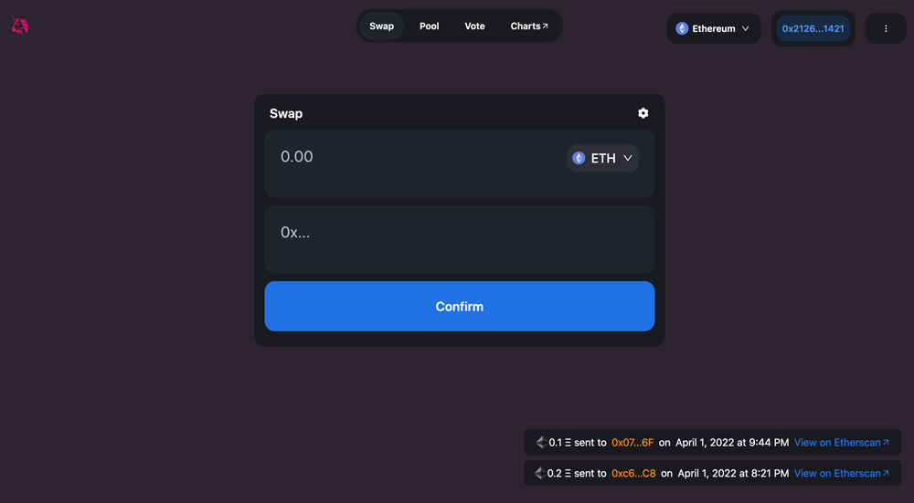

# UNISWAP Clone

This is a simple UNISWAP clone app, you can use to send eth between wallets using the Ropsten Network.

- Next JS as client - nextapp directory
- Sanity as backendServer - studio directory
- Hardhat, solidity - smart_contracts directory



## Built With

- NextJS
- Sanity
- Solidity
- TailwindCSS

[Live Demo](https://uniswap-clone-taupe.vercel.app/)

```bash
 git clone git@github.com:acushlakoncept/uniswap-clone.git

 cd uniswap-clone
 ```

 The app contains three directories
 > First one contains NextJS app
 - `cd nextapp` from root dir
 run `yarn install`
 
 - There is a .env.example, rename to .env after providing your SANITY_TOKEN AND APP_ID from 
[Sanity.io](https://www.sanity.io/)
 
 to run the app `npm run dev`

 > Second, contains Sanity app
 `cd studio` from root dir
 run `yarn install`
 to run the app `sanity start`


 > The Third contains smartcontracts
`cd smart_contracts` from root dir
run `npx hardhat compile` to compile the contract
run `npx hardhat run scripts/deploy.js --network ropsten` to deploy contract to ropsten network

## Acknowledgement

[Build Uniswap Blockchain Web 3.0 App with Solidity | Next.js | Sanity.io by Clever Programmer](https://www.youtube.com/watch?v=xXxjRzdYIss)